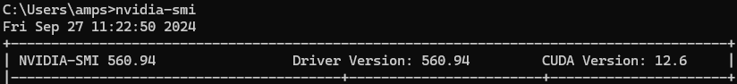
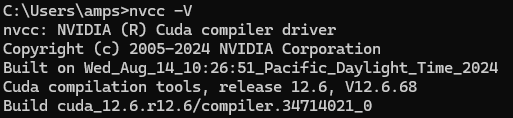

1. 그래픽 드라이버 설치
2. CUDA Toolkit 설치
    1. cmd 창에 nvidia-smi 입력해 cuda 버전 확인
        
        
        
    2. https://developer.nvidia.com/cuda-toolkit
        1. 아래 폴더에 설치됨
        2. C:\Program Files\NVIDIA GPU Computing Toolkit\CUDA\
    3. nvcc -V 명령어 입력 시 아래 출력 나오면 설치 잘 된거임
        
        
        
3. cuDDN 설치
    1. https://developer.nvidia.com/cudnn-downloads
    2. 설치 후 C:\Program Files\NVIDIA\CUDNN\v9.4 경로에서  bin, include, lib, NVIDIA_SLA_cuDNN_Support 4개의 파일을 CUDA Toolkit이 설치된 폴더에 복사 붙여넣기
4. 환경 변수 설정
    1. 아래 3개의 경로를 Path에 추가
    
    ```python
    C:\Program Files\NVIDIA GPU Computing Toolkit\CUDA\v12.6\lib
    C:\Program Files\NVIDIA GPU Computing Toolkit\CUDA\v12.6\bin
    C:\Program Files\NVIDIA GPU Computing Toolkit\CUDA\v12.6\include
    ```
    
5. 링크로 들어가 환경에 맞는 torch 설치
    1. https://pytorch.org/get-started/locally/